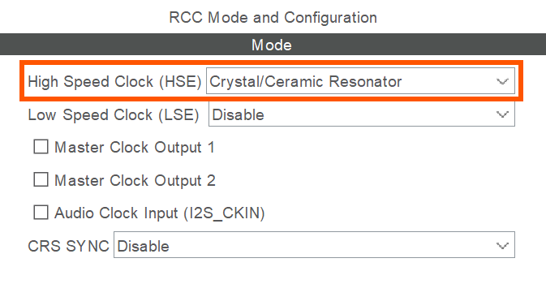
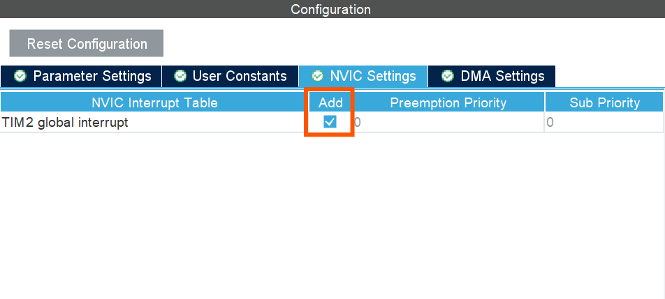
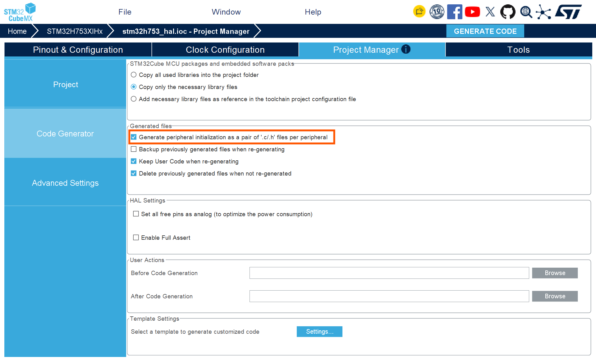

# F´ Project Tutorial for STM32-Supported MCUs

>[!IMPORTANT]
> This project showcases the STM32H753XIH6 running on a STM32H753I-EVAL2 board as a worked example. Peripheral choice, pins, and clock configuration are always board-specific and always require your own CubeMX configuration - but the `fprime-stm32 sync` step that wires CubeMX's generated code into the F' CMake build works for any STM32H7 chip/board, not just this one.

This tutorial is meant for F´ users who want to create and develop an F´ project for any of the F´ supported STM32 microcontrollers. If you are a new F´ user seeking to learn about the basics of creating components, using events, telemetry, commands, and parameters, and integrating topologies with the goal of running F´ on embedded hardware, we recommend taking the [LED Blinker tutorial](https://fprime.jpl.nasa.gov/latest/tutorials-led-blinker/docs/led-blinker) first.

This tutorial will allow you to create, build and deploy your own F´ project on any of the supported STM32 family 32-bit microcontrollers based on the Arm Cortex®-M processor using the `fprime-stm32` and [`fprime-baremetal`](https://github.com/fprime-community/fprime-baremetal) libraries.

> [!TIP]
> The Reference Project for this tutorial is located the [Fprime Baremetal Reference Project](https://github.com/Iva-L/fprime-baremetal-reference/tree/library-fprime-stm32). If you are stuck at some point during this tutorial, you may refer to that reference as the "solution".

## Prerequisites

In order to run through this tutorial, users should first have the following prerequisites ready:

1. Meet the [F´ System Requirements](https://github.com/nasa/fprime?tab=readme-ov-file#system-requirements).
2. Have [F' installed](https://fprime.jpl.nasa.gov/latest/docs/getting-started/installing-fprime/) already.
3. An IDE or text editor supporting copy-paste.
> [!TIP]
> Using an IDE or text editor with FPP language support can significantly improve your development experience. [VSCode](https://code.visualstudio.com/) has [extensions](https://marketplace.visualstudio.com/items?itemName=jet-propulsion-laboratory.fpp) that support the FPP language syntax.
5. Acquire any familiy-supported STM32 board.
6. Have [STM32CubeMX](https://www.st.com/en/development-tools/stm32cubemx.html) initialization code generator installed for STM32 hardware configuration.
> [!IMPORTANT]
> If you do not have the hardware yet, you can still follow this tutorial! You should just skip the Hardware sections.

## Troubleshooting
If at any point during this tutorial you encounter issues:

1. **Check your current directory:** Ensure you are in the correct directory as specified in each step of the tutorial.
2. **Activate your virtual environment:** Always make sure your F´ project's virtual environment is activated with `. fprime-venv/bin/activate`.
3. **Refer to the F´ troubleshooting guide:** Visit [F´ Installation and Troubleshooting](https://fprime.jpl.nasa.gov/latest/docs/getting-started/installing-fprime/#troubleshooting) for common installation and setup issues.
4. **Verify your F´ installation:** Run `fprime-util --help` to ensure F´ tools are properly installed.
5. **Verify your build environment:** Ensure that your project's build directory is clean and properly configured before attempting to build your F´ project. You can purge the CMake cache by running `fprime-util purge` in your project's build directory.
6. **Verify your toolchain:** Ensure that the toolchain required for building your F´ project is correctly installed and accessible in your environment. Also, check you are passing the correct toolchain name to your build commands, as in `fprime-util build <toolchain-name>`.


## Tutorial Steps

1. [Project Setup](#1-project-setup)

---

## 1. Project Setup

> [!NOTE]
> If you have followed the [LED Blinker tutorial](https://fprime.jpl.nasa.gov/latest/tutorials-led-blinker/docs/led-blinker) previously, this should feel very familiar...

An F´ Project ties to a specific version of tools to work with F´. In order to create
this project and install the correct version of tools, you should perform a bootstrap of F´:

1. Ensure you meet the [F´ System Requirements](https://github.com/nasa/fprime?tab=readme-ov-file#system-requirements)
2. [Bootstrap your F´ project](https://fprime.jpl.nasa.gov/latest/docs/getting-started/installing-fprime/#creating-a-new-f-project) with the name of your project. In this tutorial we will use `stm32h7-project` as the project name and `Stm32h7Project` for the project namespace.

Bootstrapping your F´ project created a folder called `stm32h7-project` (or any name you chose) containing the standard F´ project structure as well as the virtual environment up containing the tools to work with F´.

Navigate to your project directory and activate your virtual environment if you have not already done so:
```sh
cd stm32h7-project
. fprime-venv/bin/activate
```

## 2. Installing the ARM GNU Toolchain

The `fprime-stm32` library uses the `ARM GNU Toolchain`, so before building your project for STM32 MCUs it is essential to have this toolchain installed and properly configured. Please ensure that you have the toolchain installed and accessible in your environment.

If you already have the ARM GNU Toolchain installed, you can skip this step. Otherwise, follow the instructions below to install it.

For Ubuntu-based systems, you can install the ARM GNU Toolchain using the following commands:
```sh
# Update package lists and install the ARM GNU Toolchain
sudo apt-get update

# Install the ARM GNU Toolchain
sudo apt-get install -y gcc-arm-none-eabi libnewlib-arm-none-eabi libstdc++-arm-none-eabi-dev
```
> [!IMPORTANT]
> If you are using a different operating system, refer to the official [ARM GNU Toolchain installation guide](https://learn.arm.com/install-guides/gcc/arm-gnu/) for your platform.

Finally, verify the installation by checking the version of the ARM GNU Toolchain:
```sh
arm-none-eabi-gcc --version
arm-none-eabi-g++ --version
```
## 3. Using `fprime-stm32`

The `fprime-stm32` package is dependent on the `fprime-baremetal` package, which provides the core support for building F´ projects on bare-metal platforms. Ensure that the `fprime-baremetal` package is included in your project before using `fprime-stm32`.

For this reason, you should also add the `fprime-baremetal` package as a submodule inside the `\lib` directory of your project if it is not already included:
```sh
# In stm32h7-project
git submodule add https://github.com/fprime-community/fprime-baremetal.git lib/fprime-baremetal
git submodule update --init --recursive
```

Now, the `fprime-stm32` package provides the necessary support for building F´ projects targeting STM32 microcontrollers. Ensure that this package is included in your project and properly configured before attempting to build for STM32.

Now, add the `fprime-stm32` package as a submodule inside the `\lib` directory of your project if it is not already included:
```sh
git submodule add https://github.com/fprime-community/fprime-stm32.git lib/fprime-stm32 # Update this URL when fprime-stm32 library releases
git submodule update --init --recursive
```

Finally, edit the `settings.init` file in your root project directory to include the STM32 build target and relevant configurations.

To do so add the following line bellow `framework_path: ./lib/fprime`:

```ini
library_locations: ./lib/fprime-baremetal:./lib/fprime-stm32
```

## 4. Adding the /Hardware Directory

The `/Hardware` directory is used to store hardware-specific configurations and drivers for your STM32 project. To add this directory to your project, copy the hardware template directory of your board's family MCU from the `fprime-stm32` package:

```sh
# In stm32h7-project
cp -r lib/fprime-stm32/fprime-stm32/Templates/stm32h7/Hardware Stm32h7Project
```

Inside the `/Hardware` directory, you can find the hardware-specific configurations for your STM32 project. You can now modify these files according to your project's requirements.

You'll also need the `fprime-stm32` CLI tool, which wires a CubeMX-generated project into this `/Hardware` directory and the F' CMake build for you:

```sh
# In stm32h7-project
pip install -e lib/fprime-stm32/tools/fprime-stm32-cli
```

## 5. Adding the F´ Configuration Overrides

When running F´ on Linux or POSIX-based targets, the framework relies on operating system services and generous default memory limits. However, spaceflight software enforces a strict **zero dynamic memory allocation policy after boot**. In a bare-metal environment, every task stack, telemetry buffer, and message queue must be statically allocated upfront.

While microprocessors (MPUs) running Linux have ample RAM to handle large default buffers, bare-metal microcontrollers (MCUs) operate under tight memory constraints. For instance, the **STM32H753xx** series features **2 MB of Flash** and **1 MB of RAM** (split across DTCM and AXI SRAM banks). The default F´ configurations—designed for desktop and Linux targets—will quickly exhaust a microcontroller's RAM if left unadjusted.

F´ allows you to override framework-wide constants by providing custom configuration files in your project's `config/` directory. These overrides allow you to scale down framework buffer sizes, queue capacities, max string lengths, and component hash tables to fit the exact RAM constraints of your MCU.

### 5a. Copying the Configuration Overrides Template

To apply the bare-metal memory configuration for the STM32H7, copy the template files from the `fprime-stm32` library into your project's `config/` directory:

```bash
# In stm32h7-project
cp -r lib/fprime-stm32/fprime-stm32/Templates/stm32h7/config ./
```

> [!NOTE] 
> This template pre-configures key F´ settings (such as `AcConstants.fpp`, `FpConstants.fpp`, and `TlmChanImplCfg.hpp`) to fit comfortably within the 1 MB RAM limit of the STM32H753xx series. If you are targeting an MCU with a smaller memory footprint (such as an STM32F4 or STM32F7 with 128–512 KB RAM), you will need to further tune queue depths, telemetry hash bucket sizes, and buffer capacities within the files in `config/`.

Finaly, inside your project's `settings.ini` file, make sure to include the path to your `config/` directory so that F´ picks up your custom configuration overrides. Just bellow the `library_locations:` line add:

```ini
config_directory: ./config
```

This ensures that F´ will use your custom configuration settings from the `config/` directory. 

In the next step we will be creating a STM32CubeMX project for your STM32 MCU to configure the peripherals and generate the initialization code.


## 6. Creating a STM32CubeMX Project

STM32CubeMX will generate the necessary HAL (Hardware Abstraction Layer) libraries and initialization code for your STM32 MCU. F´ will need these HAL libraries and initialization code to properly interface with the hardware.

Steps to Create a STM32CubeMX Project:

1. Open STM32CubeMX and create a new project for your STM32 MCU.
2. Configure the peripherals and middleware according to your project requirements.
3. In Project Manager -> Project, set **Toolchain/IDE** to **CMake**. This matters: it's what makes CubeMX generate `cmake/stm32cubemx/CMakeLists.txt`, which `fprime-stm32 sync` reads to learn which chip, HAL modules, and peripheral-init files your project actually needs.
4. Generate the project directly into a new subdirectory of `Hardware/`, named after your chip (e.g. `Hardware/stm32h743_hal/` for an STM32H743). Generate the initialization code and HAL libraries.
5. Run `fprime-stm32 sync Hardware/<name>_hal` to wire that generated project into the F' CMake build. You never hand-copy or hand-edit `Hardware/CMakeLists.txt`, `Hardware/linker/`, or `Hardware/startup/` yourself.

> [!NOTE]
> If you have worked with STM32CubeMX before, this process should feel familiar...
> But if you are new to STM32CubeMX, follow the next creation example carefully to set up your project correctly.

Here is an example of how to create a STM32CubeMX project for the STM32H753XIH6 MCU running on a STM32H753I-EVAL2 development board:

### 1. Open STM32CubeMX and select "ACCESS TO MCU SELECTOR".

<p align="center">
  
</p>

> [!NOTE]
> If you will be working on a commercial STM32 development board, select "ACCESS TO BOARD SELECTOR" and make sure to select the correct board to ensure proper configuration and initialization.

### 2. Choose your specific STM32H7 MCU or development board and click "Start Project". 

For this project, we will be using the STM32H753XIH6 MCU:

<p align="center">
  
</p>

> [!NOTE]
> This MCU has a Memory Protection Unit (MPU) and supports various high-speed peripherals, making it suitable for complex embedded applications, but it's not yet supported by `fprime-stm32`. Select no when prompted after clicking "Start Project" to enable the MPU.

## 7. Peripheral, Clock, and Middleware, Configuration

With the STM32CubeMX project open, we can now proceed to configure the peripherals, clock settings, and middleware required for our application.

### 1. One GPIO pin as an output to control an LED _(GPIO_PORT_F, GPIO_PIN_10)_. 
* For this, select pin PF10 in the pinout view and configure it as an output:

<p align="center">
  
</p>


### 2. One UART interface for serial communication _(USART1)_.

> [!IMPORTANT]
> It is important to configure the UART interface exactly as specified to ensure proper communication with the gds system.

* First go to the "Connectivity" section in STM32CubeMX and select "USART1" to configure the UART interface. Here select the mode as "Asynchronous" and disable hardware flow control (RS232).

* Is necessary for `USART1` to have DMA enabled for efficient data transfer. As this port will be used for communication with the gds system, make sure to enable DMA for both TX (`DMA_Stream_0`) and RX (`DMA_Stream_1`) channels in the STM32CubeMX configuration by clicking the "ADD" button.

<p align="center">
  
</p>

<div style="display: flex; gap: 20px; justify-content: center;">
<div>

* `USART1_TX` will be configured on pin `PB14`, as we are working on the STM32H753I-EVAL2 development board, and this pin corresponds to the TX function for USART1 on this board.

<p align="center">
  
</p>
</div>

<div>

* `USART1_RX` will be configured on pin `PB15`, as this pin corresponds to the RX function for USART1 on the STM32H753I-EVAL2 development board.

<p align="center">
  
</p>
</div>
</div>


* Ensure that the parameter settings for `USART1` match the following configuration for communication with the gds system:

<div style="display: flex; gap: 20px; justify-content: center;">

<div>

| Basic Parameters |  |
|---|---|
| **Parameter** | **Value** |
| Baud Rate | 115200 |
| Word Length | 8 Bits |
| Stop Bits | 1 |
| Parity | None |
| Hardware Flow Control | None |
| Mode | Asynchronous |
</div>

<div>

| Advanced Parameters |  |
|---|---|
| **Parameter** | **Value** |
| Data Direction | Receive and Transmit |
| Over Sampling | 16 Samples |
| Single Sample | Disable |
| ClockPrescaler | 1 |
| Fifo Mode | Disable |
| Rxfifo Threshold | 1/8 Full |
| Txfifo Threshold | 1/8 Full |
</div>

<div>

| Advanced Features |  |
|---|---|
| **Parameter** | **Value** |
| Auto Baud Rate | Disable |
| TX Pin Active Level Inversion | Disable |
| RX Pin Active Level Inversion | Disable |
| Data Inversion | Disable |
| Tx and Rx Pin Swapping | Disable |
| Overrun | Enable |
| DMA on RX Error | Enable |
| MSB First | Disable |
</div>
</div>

### 3. Clock Configuration
Because TIM2 is used as a custom microsecond clock, it is necessary to configure the clock source first before setting the prescaler for the desired timing resolution.

* First go to System Core -> RCC (Reset and Clock Control) and configure the High Speed External (HSE) clock as Crystal/Ceramic Resonator.

<p align="center">
  
</p>

* Then, go to the clock configuration window and ensure that the HSE clock is selected as the PLL source for the system clock and modify the preescalers as needed to achieve the desired system clock frequency. Because for this MCU the maximum system clock frequency is 480 MHz, the preescalers were configured as follows:

<div style="display: flex; gap: 20px; justify-content: center;">

<div>

| Clock Configuration| |
|---|---|
| **Preescaler** | **Value** |
| `DIVM1` | /5 |
| `DIVN1` | x192 |
| `DIVVP2` | /2 |
| `D1CPRE` | /1 |
| `HPRE` | /1 |
| `D1PPRE` | /2 |
| `D2PPRE1` | /2 |
| `D2PPRE2` | /2 |
| `D3PPRE` | /2 |
</div>


<p align="center">
  
</p>

</div>


> [!NOTE]
> The clock configuration will vary for every project and microcontroller, so always double-check the settings for your specific hardware.

### 3. One Timer peripheral for the custom microsecond clock _(TIM2)_.

TIM2 is configured as a custom microsecond clock for precise timing operations replacing the default system tick timer. For this, first enable the TIM2 peripheral clock and configure the timer for a 1 MHz frequency to achieve microsecond resolution.

* Go to `Timers -> TIM2 -> Mode` and configure its source as the internal clock.
<p align="center">
  
</p>

* Set the prescaler to achieve a `1 MHz` timer clock for this project the `APB1` timer clock `is 240 MHz` so the prescaler should be set to `239`.
<p align="center">
  
</p>

> [!TIP]
> Look at your APB1 timer clock frequency to achieve the desired 1 MHz timer clock. You can calculate the prescaler value as `(APB1 timer clock / 1 MHz) - 1`.

* Finally, enable the `TIM2` interrupt as the timer will generate update events that update the microsecond clock and rate groups accordingly.
<p align="center">
  
</p>


### 4. Generate the project directly into `Hardware/stm32h753_hal/` (Toolchain/IDE must be set to "CMake").

Now that the hardware has been configured, you can proceed to set up your project directory inside the "Project Manager" window in STM32CubeMX.

The `fprime-stm32 sync` tool needs the project name and directory to be in the `Hardware/` subdirectory and the name of the directory should end with `_hal`. The recommended convention is to match the STM32 series and part number, for example `stm32h753_hal`.

```
Hardware/
└── stm32h753_hal/
```

Also, it is important to ensure to select the toolchain as **"CMake"** in the STM32CubeMX project settings, as this allows the generated project to be compatible with the F' build system which relies on CMake for building and linking the project correctly.

If you are working with the STM32H753 series, your project directory should be named `stm32h753_hal` and placed under the `Hardware/` subdirectory:

<p align="center">
  
</p>

For CubeMX to generate all the HAL libraries inside the `Drivers/` directory, make sure that the "Generate peripheral initialization as a pair of `.c/.h` files" as well as "Copy all used libraries into the project folder" options are enabled in the CubeMX project settings. You can find these options under **Project Manager -> Code Generator**:

<p align="center">
  
</p>

Now that you have configured the project settings and ensured the toolchain is set to "CMake", just select **"Project -> Generate Code"** to generate the project files into the specified directory.

A confirmation message should appear indicating that the project has been successfully generated, and the files should now be present in the `Hardware/stm32h753_hal/` directory. Following this structure:

```
Hardware/
└── stm32h753_hal/
    ├── cmake/
    ├── Core/
    ├── Drivers/
    ├── .mxproject
    ├── CMakeLists.txt
    ├── CMakePresets.json
    ├── startup_stm32h753xx.s
    ├── stm32h753_hal.ioc
    └── STM32H753xx_FLASH.ld
```

With the project structure in place and the necessary files generated, you are now ready to synchronize the project with the F' build system.

### 5. Run `fprime-stm32 sync` to wire the generated project into the F' CMake build:

The library `fprime-stm32` includes a CLI tool that allows you to synchronize your CubeMX-generated project with the F' build system. It ensures that the necessary modifications are made to the linker script and startup files, and updates the CMake build configuration accordingly. If you have not installed the tool yet, you can do so by running:

```sh
# In stm32h7-project
pip install -e lib/fprime-stm32/tools/fprime-stm32-cli
```

Then, you can synchronize your CubeMX-generated project with the F' build system by running in your project root directory:

```sh
# In stm32h7-project
fprime-stm32 sync Stm32h7Project/Hardware/stm32h753_hal/
```

This patches the CubeMX-generated linker script and startup file for F´'s bare-metal zero-dynamic-memory architecture (DMA-safe buffers in AXI SRAM, CPU-only state in DTCM), writes them to `Hardware/linker/` and `Hardware/startup/`, and regenerates `Hardware/CMakeLists.txt` from CubeMX's own `cmake/stm32cubemx/CMakeLists.txt` so the `FprimeStm32` library target picks up exactly the HAL sources/includes/defines your peripheral configuration needs - for any STM32H7 chip, not just the STM32H753XIH6 used in this example. It also wires `Hardware/` and `config/` into the project's CMake build graph (the root and namespace `CMakeLists.txt` files), and exports three CMake cache variables from `Hardware/CMakeLists.txt` - `FPRIME_STM32_LINKER_SCRIPT`, `FPRIME_STM32_STARTUP_SOURCE`, `FPRIME_STM32_IT_SOURCE` - that a deployment's own `CMakeLists.txt` needs to reference. Add `--dry-run` first to preview the changes.

You don't have a deployment yet at this point in the tutorial (that's step 8), so there's nothing for `sync` to wire there yet - it'll tell you so. Once you've created one, re-run this same `sync` command with `--wire-deployment <name>` (step 8b) to finish connecting it to the STM32 build - no hand-written CMake required.

Re-run `fprime-stm32 sync` any time you regenerate `Hardware/stm32h753_hal/` from CubeMX (e.g. after adding a peripheral). It re-derives everything from the current CubeMX output and preserves any project-specific linker placement rules you've hand-added since the last sync (e.g. pinning a specific symbol into DTCM), and every file it touches is patched idempotently - re-running it again once everything is already wired makes no further changes.

## 8. Creating a Custom STM32 Deployment

Before building the project, you need to create a deployment for your STM32 target. A deployment defines how the various components of your F´ project are connected and configured for a specific target platform. 

Create a new deployment with the following:

```sh
# In stm32h7-project
cd Stm32h7Project
mkdir -p Deployments
cd Deployments
fprime-util new --deployment
```

This will ask for some input, respond with the answers `Stm32h7Deployment` for the deployment name, accept the default `Deployments` for the deployment namespace, and `3` for the communication driver type (UART), shown below:

```
  [1/3] Deployment name (MyDeployment): Stm32h7Deployment
  [2/3] Deployment namespace (Deployments): Deployments
  [3/3] Select communication driver type
    1 - TcpClient
    2 - TcpServer
    3 - UART
    Choose from [1/2/3] (1): 3
[INFO] Found CMake file at 'stm32h7-project/Stm32h7Project/CMakeLists.txt'
Add Deployments/Stm32h7Deployment to stm32h7-project/Stm32h7Project/CMakeLists.txt at end of file? (yes/no) [yes]: yes
```
This will create a new deployment directory under `Deployments/Stm32h7Deployment` and update your `CMakeLists.txt` to include this deployment.

This deployment is not yet fully configured. As it uses the default Linux drivers, we will need to update it to use the STM32 drivers for UART, timer, and GPIO already provided by the `fprime-stm32` library.

### 8a. Updating the Deployment instances and topology

To update the deployment to use the STM32 drivers for UART, timer, and GPIO, you will need to modify the instances and topology files to replace the default Linux communication, timer and GPIO drivers with the STM32 drivers provided by the `fprime-stm32` library.

First, we will tailor the default queue and stack sizes for the STM32 deployment, you need to modify the `instances.fpp` file.

In you `Deployments/Stm32h7Deployment/` directory, open the `instances.fpp` file and look the following block of code:

```fpp
module Default {
    constant QUEUE_SIZE = 10
    constant STACK_SIZE = 64 * 1024
  }
```

and replace it with the following:

```fpp
  module Default {
    constant QUEUE_SIZE = 4
    constant STACK_SIZE = 8 * 1024
  }
```

This reduces the default queue and stack sizes to better match the constraints of the STM32 microcontroller from 10 queues and 64 KB stack to 4 queues and 8 KB stack.

Then go to the bottom of the file in the passive component instances section to update the instances and look for these drivers:

```fpp
  # ----------------------------------------------------------------------
  # Passive component instances
  # ----------------------------------------------------------------------

  instance chronoTime: Svc.ChronoTime base id 0x10010000

  instance rateGroupDriver: Svc.RateGroupDriver base id 0x10011000

  instance systemResources: Svc.SystemResources base id 0x10012000

  instance timer: Svc.LinuxTimer base id 0x10013000

  instance comDriver: Drv.LinuxUartDriver base id 0x10014000
```

and replace them with the STM32 drivers as follows:

```fpp
  # ----------------------------------------------------------------------
  # Passive component instances
  # ----------------------------------------------------------------------

  instance osTime: Svc.OsTime base id 0x10010000

  instance rateGroupDriver: Svc.RateGroupDriver base id 0x10011000

  instance systemResources: Svc.SystemResources base id 0x10012000

  instance timer: Stm32.STM32Timer base id 0x10013000

  instance comDriver: Stm32.Stm32UartDriver base id 0x10014000

  instance gpioDriver: Stm32.Stm32GpioDriver base id 0x10015000

```

Here `fprime-baremetal`'s `osTime` replaces the `chronoTime` instance, and the STM32-specific drivers replace the default Linux drivers, including the addition of a GPIO driver specific to the STM32 platform for the scope of general-purpose input/output operations.

To indicate the instances used for this deployment's topology, we will need to update the corresponding `topology.fpp` file. In the Instances used in the topology section, make sure to reference the updated STM32-specific instances such as `osTime` and `gpioDriver` instead of the default Linux instances, going from the following instances:

```fpp
  # ----------------------------------------------------------------------
  # Instances used in the topology
  # ----------------------------------------------------------------------
    instance chronoTime
    instance rateGroup_1Hz
    instance rateGroup_0_5Hz
    instance rateGroup_0_25Hz
    instance rateGroupDriver
    instance systemResources
    instance timer
    instance comDriver
    instance cmdSeq
```

to the following updated instances, which include the STM32-specific drivers:

```fpp
  # ----------------------------------------------------------------------
  # Instances used in the topology
  # ----------------------------------------------------------------------
    instance osTime
    instance rateGroup_1Hz
    instance rateGroup_0_5Hz
    instance rateGroup_0_25Hz
    instance rateGroupDriver
    instance systemResources
    instance timer
    instance comDriver
    instance cmdSeq
    instance gpioDriver
```

In the pattern graph specifiers simply replace the `chronoTime` instance with the `osTime` instance to reflect the STM32-specific timing component. Replace the following:

```fpp
        time connections instance chronoTime
```

with:

```fpp
        time connections instance osTime
```

Now let's add the connection for the UART driver in the RateGroups connections so that the 1Hz rate group can trigger the UART driver. In your `topology.fpp` file, under the `connections RateGroups` section with the 1Hz rate group, add the following line:

```fpp
      rateGroup_1Hz.RateGroupMemberOut[6] -> comDriver.run
```

This connection ensures that the UART driver is triggered by the 1Hz rate group, allowing it to run periodically as specified by the rate group.

So far, we have updated the .fpp files only, and no changes have been made to the source code files yet. Now open your source code file `Stm32h7DeploymentTopology.cpp` to make the necessary updates.

First, we will replace the current `MallocAllocator.hpp` include with the STM32-specific allocator header. Replace:

```cpp
#include <Fw/Types/MallocAllocator.hpp>
```

with:

```cpp
#include <fprime-stm32/Allocator/BootstrapAllocator.hpp>
```

And bellow this include also add the following includes for the STM32-specific drivers and other necessary headers for baremetal development:

```cpp
#include <fprime-baremetal/Os/Baremetal/MicroFs/MicroFs.hpp>
#include <config/UartDriverConfig.hpp>
#include <Fw/Logger/Logger.hpp>

// STM32 HAL include for hardware abstraction layer functions
#include "stm32h7xx_hal.h"
```

The following rate group and allocator instantiation code is specific to POSIX systems and should be updated for the STM32-specific allocator and timing configuration. Replace:

```cpp
// Instantiate a malloc allocator for cmdSeq buffer allocation
Fw::MallocAllocator mallocator;

// Rate group timing: base clock interval and divisors are coupled to rate group names
const Fw::TimeInterval rateGroupInterval(1, 0);  // 1Hz base clock
Svc::RateGroupDriver::DividerSet rateGroupDivisorsSet{{{1, 0}, {2, 0}, {4, 0}}};
// Divisors: 1Hz, 0.5Hz, 0.25Hz
```

With the STM32-specific allocator, the code should look like this _(note that the `MallocAllocator` instantiation is removed and will be replaced with the STM32-specific allocator)_:

```cpp
Svc::RateGroupDriver::DividerSet rateGroupDivisorsSet{{{100, 0}, {200, 0}, {400, 0}}};
// Divisors: 1Hz, 0.5Hz, 0.25Hz
```

And now inside the `enum Topology Constants` we will replace the `COMM_PRIORITY` constant with the new UART driver constants:

```cpp
enum TopologyConstants {
    // USART1 configuration
    BAUD_RATE = 115200,
    USART_IRQ_PREEMPT_PRIORITY = 0,
    USART_IRQ_SUB_PRIORITY = 0
};
```

With this set we can start configuring the topology for our deployment, for this go to the `configureTopology()` function and replace it with the following code snippet:

```cpp
void configureTopology() {
    // Bare-metal MicroFs (RAM-backed) filesystem initialization
    static Os::Baremetal::MicroFs::MicroFsConfig microFsConfig;
    Os::Baremetal::MicroFs::MicroFsSetCfgBins(microFsConfig, 2);
    Os::Baremetal::MicroFs::MicroFsAddBin(microFsConfig, 0, 1024, 2);
    Os::Baremetal::MicroFs::MicroFsAddBin(microFsConfig, 1, 4096, 1);
    Os::Baremetal::MicroFs::MicroFsInit(microFsConfig, 0, Stm32::getBootstrapAllocator());

    // Rate group driver needs a divisor list
    rateGroupDriver.configure(rateGroupDivisorsSet);

    // The timer rate is set to 10000 microseconds (10 ms)
    timer.open(Stm32::TimerInstance::Tim2, 10000);

    // Rate groups require context arrays.
    rateGroup_1Hz.configure(rateGroup_1HzContext);
    rateGroup_0_5Hz.configure(rateGroup_0_5HzContext);
    rateGroup_0_25Hz.configure(rateGroup_0_25HzContext);

    // Command sequencer needs to allocate memory to hold contents of command sequences
    cmdSeq.allocateBuffer(0, Stm32::getBootstrapAllocator(), 5 * 1024);

    // PrmDb file name must be supplied by the using topology
    FileHandling::prmDb.configure("PrmDb.dat");

    // Open the UART driver using the USART1 instance and the specified interrupt priorities and baud rate.
    const Fw::Success comDriverOpened = comDriver.open(FW_COM_BUFFER_MAX_SIZE, Stm32::UsartInstance::Usart1,
                                                        USART_IRQ_PREEMPT_PRIORITY, USART_IRQ_SUB_PRIORITY,
                                                        BAUD_RATE);
    // Check if the UART driver was successfully opened
    if(comDriverOpened == Fw::Success::FAILURE) {
        Fw::Logger::log("[ERROR] Failed to open UART\n");
    }

    // On-board LED1 (PF10), driven as a push-pull output
    const Fw::Success gpioDriverOpened = gpioDriver.open(Stm32::GpioPort::F, GPIO_PIN_10, Fw::Direction::OUT);
    if(gpioDriverOpened == Fw::Success::FAILURE) {
        Fw::Logger::log("[ERROR] Failed to open GPIO\n");
    }
}
```

In the `setupTopology()` function, there is an if statement that checks if the UART driver was successfully opened and logs an error message if it failed. This is for the Linux Driver, but in the STM32 bare-metal context that is checked in the `configureTopology()` function, so **delete** this check from `setupTopology()`:

```cpp
    if (state.uartDevice != nullptr) {
        Os::TaskString name("ReceiveTask");
        // Uplink is configured for receive so a socket task is started
        if (comDriver.open(state.uartDevice, static_cast<Drv::LinuxUartDriver::UartBaudRate>(state.baudRate), 
                           Drv::LinuxUartDriver::NO_FLOW, Drv::LinuxUartDriver::PARITY_NONE, 2048)) {
            comDriver.start(COMM_PRIORITY, Default::STACK_SIZE);
        } else {
            printf("Failed to open UART device %s at baud rate %" PRIu32 "\n", state.uartDevice, state.baudRate);
        }
    }
```

For the same reason, delete the conent of the `startRateGroups()` and `stopRateGroups()`. These functions should be empty as the rate groups are managed by our `TIM2` timer. Make sure to remove any code inside these functions, it should go from this:

```cpp
void startRateGroups() {
    timer.startTimer(rateGroupInterval);
}

void stopRateGroups() {
    timer.quit();
}
```

To this:

```cpp
void startRateGroups() {}
void stopRateGroups() {}
```

Finally, for the `teardownTopology()` function, you should also remove any thread management code, as the STM32 bare-metal context does not require explicit thread cleanup for the rate groups. Remove inside the `teardownTopology()` function:

```cpp
    // Other task clean-up.
    comDriver.quitReadThread();
    (void)comDriver.join();
```

and assign the resource deallocation to `Stm32::getBootstrapAllocator()`:

```cpp
    // Resource deallocation
    cmdSeq.deallocateBuffer(Stm32::getBootstrapAllocator());
```

### 8b. Wiring the STM32 Build System

The `.fpp` and `Stm32h7DeploymentTopology.cpp` edits above are enough for the topology to make sense, but a deployment created by `fprime-util new --deployment` starts out with the default Linux/CMake wiring: no ASM support, no link to the `Hardware/` and `config/` directories, and no link to the `FprimeStm32` HAL library. Building right now would fail with an error like:

```
F Prime/CMake target 'FprimeStm32' not available to deployment 'Stm32h7Project_Deployments_Stm32h7Deployment'.
```

`fprime-stm32 sync` fixes all of this for you — pass `--wire-deployment` with your deployment's name (or omit it if you only have one deployment so far; it auto-detects):

```sh
# In stm32h7-project
fprime-stm32 sync Stm32h7Project/Hardware/stm32h753_hal/ --wire-deployment Stm32h7Deployment
```

Re-run this same command (it's the same one from step 7.5) any time after creating or renaming a deployment. It patches four files, each idempotently — re-running `sync` again makes no further changes once a file is already wired:

1. **Project's root `CMakeLists.txt`** (one level above `Stm32h7Project/`): enables the ASM language (the startup file `sync` writes into `Hardware/startup/` is a `.s` assembly file; CMake won't compile it otherwise), and adds `config/` to the project's build graph.
2. **Namespace `CMakeLists.txt`** (`Stm32h7Project/CMakeLists.txt`): adds `Hardware/` to the project's build graph, so the `FprimeStm32` target it defines actually gets built.
3. **The deployment's own `CMakeLists.txt`**: adds `restrict_platforms(stm32h7)` (keeps a native/host build from even trying to configure this ARM-only deployment); adds `${FPRIME_STM32_STARTUP_SOURCE}`/`${FPRIME_STM32_IT_SOURCE}` to `SOURCES` — compiling them directly into the deployment (rather than only through the archived `FprimeStm32` static library) guarantees their strong ISR definitions override the startup file's weak `Default_Handler` aliases; adds `FprimeStm32`/`FprimeStm32Config`/`FprimeStm32Allocator`/`Os_Baremetal_OverrideNewDelete` to `DEPENDS` (the HAL library, the peripheral-selection header, the fixed-pool bootstrap allocator, and the `operator new`/`delete` overrides `Stm32h7DeploymentTopology.cpp` needs); and appends a `target_link_options(...)` block wiring in `${FPRIME_STM32_LINKER_SCRIPT}`, `-Wl,--gc-sections`, a list of `-Wl,--undefined=...` symbols that force the linker to always pull in the `operator new`/`delete` overrides even though nothing in the topology graph references them directly (without this, a bare-metal build has no heap and `new`/`delete` silently resolve to nothing), and `--specs=nosys.specs` (the newlib stub syscalls this bare-metal target needs at link time).
4. **The deployment's `Top/CMakeLists.txt`**: adds `FprimeStm32Allocator` to `DEPENDS`, since `Stm32h7DeploymentTopology.cpp` calls `Stm32::getBootstrapAllocator()`/`Stm32::lockBootstrapAllocator()`.

Add `--dry-run` first if you want to preview these four diffs before writing them.

### 8c. Rewriting Main.cpp for Bare-Metal Execution

`fprime-util new --deployment` generates a `Main.cpp` written for a hosted OS: it parses `-b`/`-d` command-line arguments with `getopt`, installs a `SIGINT`/`SIGTERM` handler to stop cleanly on Ctrl-C, and calls `Deployments::startRateGroups()` expecting that function to block until a signal arrives. None of that applies to a microcontroller with no command line, no signals, and no OS to return control to — the bare-metal `startRateGroups()`/`stopRateGroups()` you already emptied out in step 8a return immediately, so this `Main.cpp` would just exit right after `setupTopology()` and never run anything.

Replace the entire contents of `Stm32h7Project/Deployments/Stm32h7Deployment/Main.cpp` with:

```cpp
// ======================================================================
// \title  Main.cpp
// \brief Bare-metal cyclic executive entry point for the STM32 deployment.
// ======================================================================
// Used to access topology functions and component instances
#include <Stm32h7Project/Deployments/Stm32h7Deployment/Top/Stm32h7DeploymentTopology.hpp>
#include <Stm32h7Project/Deployments/Stm32h7Deployment/Top/Stm32h7DeploymentTopologyAc.hpp>

#include <fprime-stm32/Allocator/BootstrapAllocator.hpp>
#include <Os/Os.hpp>
#include <fprime-baremetal/Os/TaskRunner/TaskRunner.hpp>
#include <fprime-stm32/Drv/STM32Timer/STM32Timer.hpp>
#include <fprime-stm32/Drv/STM32UartDriver/Stm32UartDriver.hpp>
#include <main.h>
#include <stm32h7_clock.h>
#include <tim2_clock.h>
#include "stm32h7xx_hal.h"

int main() {
    SCB_EnableICache();
    SCB_EnableDCache();

    HAL_Init();

    // Initialize the system clocks, including the HSE->PLL1 clock configuration.
    FprimeStm32_ClockInit();
    Stm32_Tim2ClockInit();

    Os::init();
    Os::Baremetal::TaskRunner& taskRunner = Os::Baremetal::TaskRunner::getSingleton();

    Deployments::TopologyState inputs = {};
    Deployments::setupTopology(inputs);
    Stm32::lockBootstrapAllocator();

    while (true) {
        // Run a cooperative state machine step for each active registered component.
        taskRunner.runAll();

        // Poll the TIM2 CH2 hardware tick source and the UART driver.
        Deployments::timer.poll();
        Deployments::comDriver.poll();
    }
}
```

A few things worth calling out about this replacement:
- `Stm32h7DeploymentTopologyAc.hpp` (the *autocoded* topology header, as opposed to the hand-written `Stm32h7DeploymentTopology.hpp`) is a new include — it's what declares the `Deployments::timer` and `Deployments::comDriver` instances this `main()` calls directly.
- Cache and clock initialization happen before anything else, in this order: the Cortex-M7's I/D caches are undefined at reset and must be enabled before any DMA-capable driver touches memory; `HAL_Init()` must run before `FprimeStm32_ClockInit()` configures the PLL; `Stm32_Tim2ClockInit()` (which starts TIM2's free-running base counter) must run after the clock tree is correct, since its prescaler assumes the final clock frequency.
- There is no `startRateGroups()`/blocking call at all — the `while (true)` loop itself *is* the cyclic executive. `taskRunner.runAll()` gives every registered active/queued component one cooperative dispatch pass; `timer.poll()` and `comDriver.poll()` service the hardware tick source and the UART DMA state machine, which (per step 8a) don't have their own OS thread to run on.

## 9. Building the Project for STM32

Once the ARM GNU Toolchain is installed and verified and the necessary submodules and directories are added, you can generate and build your F´ project for STM32 microcontrollers using the following commands:
```sh
fprime-util generate stm32h7
fprime-util build stm32h7
```

This will compile your project for the STM32 target using the specified toolchain. To setup this toolchain as your default build target, you can add the following line into your `settings.init` just bellow the `library_locations` line we added last step:

```
default_toolchain: stm32h7
```

Now to build your project for the STM32 target, simply run the the same commands as before without specifying the target explicitly:
```sh
fprime-util generate 
fprime-util build 
```


